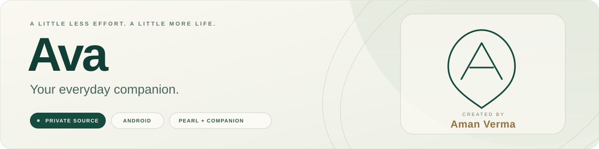
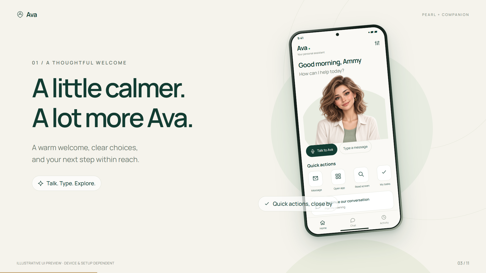
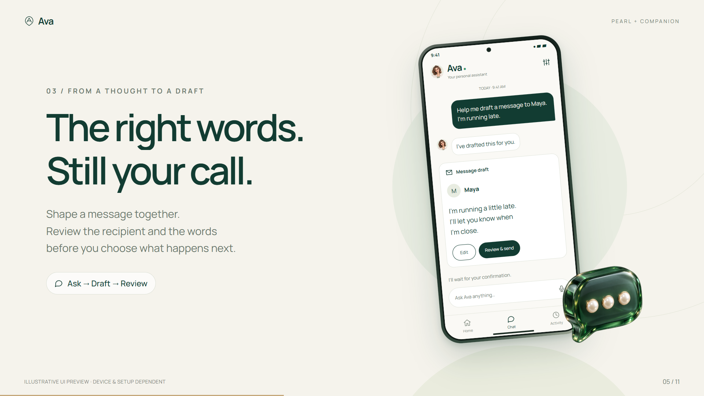
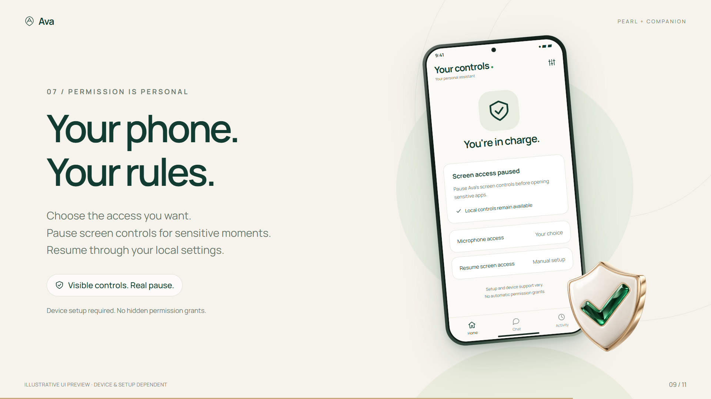
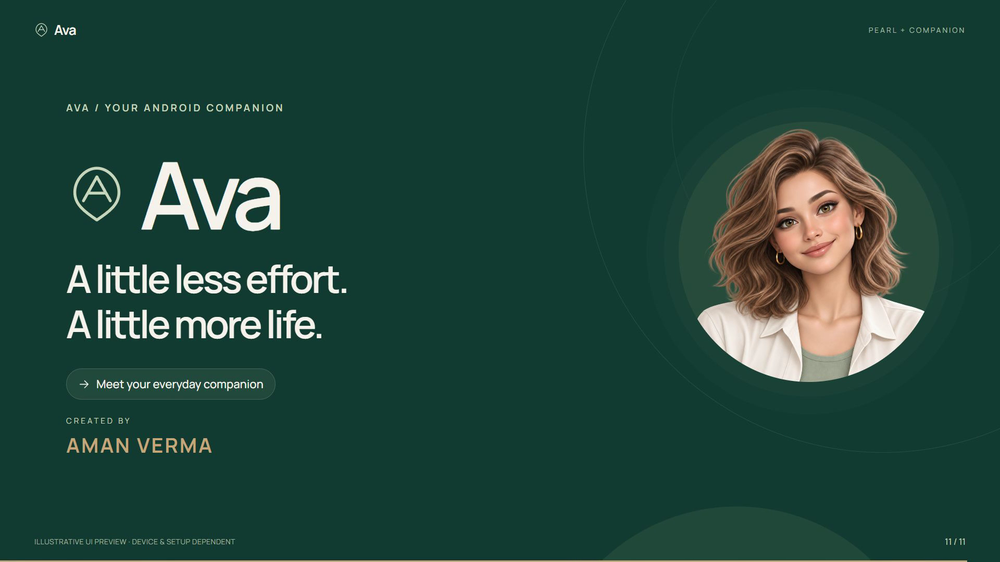
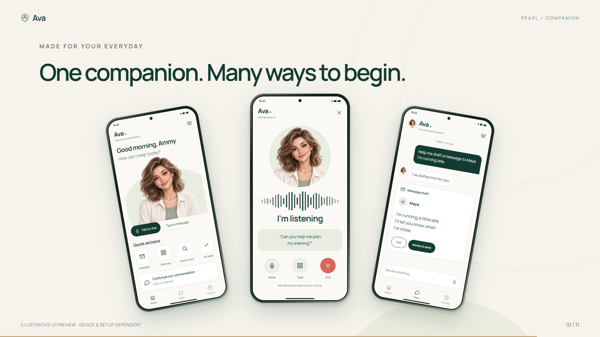

# Ava Assistant — Showcase

Ava is an Android voice and chat assistant created by Aman Verma.

**A showcase of Ava's features, interface and design.**

## What Ava does
- Voice and chat assistant on Android with a custom Pearl interface
- Python FastAPI backend for task orchestration
- Wake-word detection
- Permission-aware controls using Accessibility and Shizuku
- Setup diagnostics and bounded task recovery

## Tech (high level)
Kotlin (Android) · Python / FastAPI · WebSocket

## Gallery

## Creator
Aman Verma — Digital Marketing Manager | Full Stack & Android Developer
LinkedIn: https://www.linkedin.com/in/aman-verma-delhi/
